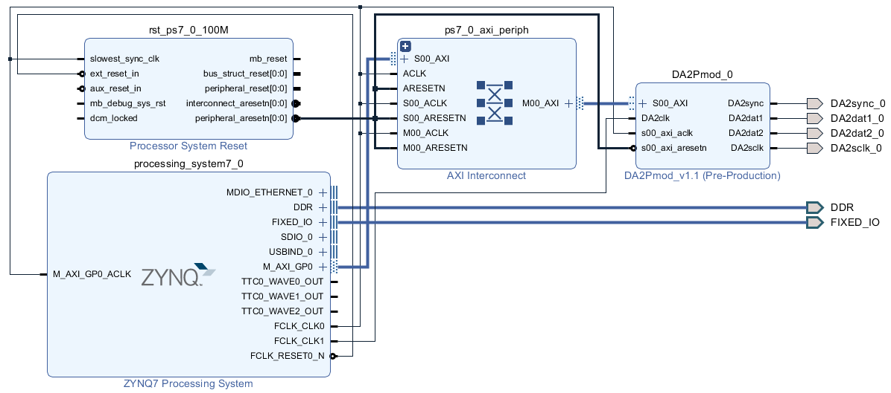

# Lab 6: PmodDA2 Function Generator
{: .no_toc }

## Table of Contents
{: .no_toc .text-delta }

1. TOC
{:toc}

---

## Overview

In this lab, you will create a function generator using the PmodDA2 digital-to-analog converter. You will generate sine, square, triangle, and sawtooth waveforms at various frequencies using lookup tables and DDS (Direct Digital Synthesis) techniques.

**Related Modules**: [Module 9: ADC and SPI Communication]({{ site.baseurl }}/docs/modules/module09.html), [Module 11: Digital-to-Analog Conversion]({{ site.baseurl }}/docs/modules/module11.html)

---

## Learning Objectives

By completing this lab, you will be able to:

1. Configure the Zynq SPI interface for DAC output
2. Implement lookup table-based waveform generation
3. Apply Direct Digital Synthesis (DDS) principles
4. Control output frequency through phase accumulator tuning
5. Generate multiple waveform types

---

## Prerequisites

- Completion of Lab 5 (ADC Interface)
- Understanding of DAC operation
- Familiarity with waveform mathematics

---

## Required Hardware

- Zybo Z7-10 or Z7-20 development board
- **PmodDA2** - Dual 12-bit DAC module
- Oscilloscope for waveform verification
- Audio amplifier (optional, for audio output)

---

## Background

### PmodDA2 Specifications

| Parameter | Value |
|-----------|-------|
| Resolution | 12 bits |
| Channels | 2 (independent) |
| Max Update Rate | 1.5 MSPS |
| Output Range | 0 to VREF (3.3V) |
| Interface | SPI (Mode 0) |
| DAC Chip | DAC121S101 |



### DAC121S101 Serial Interface

```
16-bit SPI command format:
┌────┬────┬─────┬─────┬─────┬─────┬─────┬─────┬─────┬─────┬─────┬─────┬────┬────┬────┬────┐
│ 15 │ 14 │ 13  │ 12  │ 11  │ 10  │  9  │  8  │  7  │  6  │  5  │  4  │ 3  │ 2  │ 1  │ 0  │
├────┴────┼─────┴─────┼─────┴─────┴─────┴─────┴─────┴─────┴─────┴─────┴────┴────┴────┴────┤
│  Mode   │    X X    │                    12-bit DAC Data (D11-D0)                       │
└─────────┴───────────┴───────────────────────────────────────────────────────────────────┘

Mode bits (15:14):
  00 = Normal operation
  01 = Power-down 1kΩ to GND
  10 = Power-down 100kΩ to GND
  11 = Power-down Hi-Z
```

---

## Part 1: DAC Driver

### Initialization and Write Function

```c
#include "xspips.h"
#include <math.h>

#define SPI_DEVICE_ID    XPAR_XSPIPS_0_DEVICE_ID
#define DAC_NORMAL_MODE  0x0000

XSpiPs DacSpi;

int DAC_Init(void) {
    XSpiPs_Config *SpiConfig;
    int Status;
    
    SpiConfig = XSpiPs_LookupConfig(SPI_DEVICE_ID);
    if (SpiConfig == NULL) return XST_FAILURE;
    
    Status = XSpiPs_CfgInitialize(&DacSpi, SpiConfig,
                                   SpiConfig->BaseAddress);
    if (Status != XST_SUCCESS) return XST_FAILURE;
    
    // Master mode, Mode 0, manual slave select
    XSpiPs_SetOptions(&DacSpi, 
                      XSPIPS_MASTER_OPTION |
                      XSPIPS_FORCE_SSELECT_OPTION);
    
    // Fast clock for smooth waveforms
    XSpiPs_SetClkPrescaler(&DacSpi, XSPIPS_CLK_PRESCALE_16);
    
    xil_printf("DAC Initialized\r\n");
    return XST_SUCCESS;
}

void DAC_Write(uint8_t channel, uint16_t value) {
    uint8_t txBuffer[2];
    
    // Limit to 12 bits
    value &= 0x0FFF;
    
    // Format: Mode(2) + XX(2) + Data(12)
    // Normal mode = 00
    txBuffer[0] = (value >> 8) & 0x0F;  // Upper 4 bits
    txBuffer[1] = value & 0xFF;          // Lower 8 bits
    
    // Select DAC channel (0 or 1)
    XSpiPs_SetSlaveSelect(&DacSpi, channel);
    
    // Send 16-bit command
    XSpiPs_PolledTransfer(&DacSpi, txBuffer, NULL, 2);
}

void DAC_WriteVoltage(uint8_t channel, float voltage) {
    // Convert voltage (0-3.3V) to 12-bit code
    if (voltage < 0.0f) voltage = 0.0f;
    if (voltage > 3.3f) voltage = 3.3f;
    
    uint16_t code = (uint16_t)((voltage / 3.3f) * 4095.0f);
    DAC_Write(channel, code);
}
```

---

## Part 2: Waveform Lookup Tables

### Lookup Table Generation

```c
#define TABLE_SIZE  256

// Lookup tables (pre-computed for speed)
uint16_t sineTable[TABLE_SIZE];
uint16_t triangleTable[TABLE_SIZE];
uint16_t sawtoothTable[TABLE_SIZE];
uint16_t squareTable[TABLE_SIZE];

void GenerateLookupTables(void) {
    for (int i = 0; i < TABLE_SIZE; i++) {
        // Sine wave: ranges 0 to 4095
        float angle = (2.0f * M_PI * i) / TABLE_SIZE;
        sineTable[i] = (uint16_t)((sin(angle) + 1.0f) * 2047.5f);
        
        // Triangle wave
        if (i < TABLE_SIZE / 2) {
            triangleTable[i] = (uint16_t)((4095.0f * i * 2) / TABLE_SIZE);
        } else {
            triangleTable[i] = (uint16_t)(4095.0f - 
                               (4095.0f * (i - TABLE_SIZE/2) * 2) / TABLE_SIZE);
        }
        
        // Sawtooth wave
        sawtoothTable[i] = (uint16_t)((4095.0f * i) / TABLE_SIZE);
        
        // Square wave (50% duty cycle)
        squareTable[i] = (i < TABLE_SIZE / 2) ? 4095 : 0;
    }
    
    xil_printf("Lookup tables generated\r\n");
}
```


---

## Part 3: Direct Digital Synthesis

### DDS Concept

```
┌─────────────────────────────────────────────────────────────────────────┐
│                    DIRECT DIGITAL SYNTHESIS (DDS)                        │
├─────────────────────────────────────────────────────────────────────────┤
│                                                                          │
│   ┌─────────────┐     ┌───────────────┐     ┌─────────┐     ┌───────┐   │
│   │   Tuning    │     │    Phase      │     │  Lookup │     │  DAC  │   │
│   │    Word     ├────►│  Accumulator  ├────►│  Table  ├────►│ Output│   │
│   │     M       │     │  (N bits)     │     │         │     │       │   │
│   └─────────────┘     └───────────────┘     └─────────┘     └───────┘   │
│                              │                                           │
│                              │ Clk                                       │
│                              ▼                                           │
│                        ┌──────────┐                                      │
│                        │  fclk    │                                      │
│                        └──────────┘                                      │
│                                                                          │
│   Output Frequency: fout = (M × fclk) / 2^N                             │
│                                                                          │
└─────────────────────────────────────────────────────────────────────────┘
```

### DDS Implementation

```c
typedef struct {
    uint32_t phaseAccumulator;  // 32-bit phase accumulator
    uint32_t tuningWord;        // Frequency control word
    uint16_t *waveTable;        // Pointer to current waveform
    uint8_t channel;            // DAC channel
} DDSChannel_t;

DDSChannel_t ddsChannel0 = {0, 0, sineTable, 0};
DDSChannel_t ddsChannel1 = {0, 0, sineTable, 1};

#define SAMPLE_RATE     100000  // 100 kHz update rate
#define ACCUM_BITS      32

void DDS_SetFrequency(DDSChannel_t *dds, float frequency) {
    // Tuning word = (frequency × 2^32) / sample_rate
    dds->tuningWord = (uint32_t)((frequency * 4294967296.0f) / SAMPLE_RATE);
    
    xil_printf("Set frequency to %d Hz, tuning word = %lu\r\n",
               (int)frequency, dds->tuningWord);
}

void DDS_SetWaveform(DDSChannel_t *dds, uint16_t *table) {
    dds->waveTable = table;
}

void DDS_Update(DDSChannel_t *dds) {
    // Advance phase accumulator
    dds->phaseAccumulator += dds->tuningWord;
    
    // Use upper 8 bits as table index (256-entry table)
    uint8_t tableIndex = (dds->phaseAccumulator >> 24) & 0xFF;
    
    // Output sample to DAC
    DAC_Write(dds->channel, dds->waveTable[tableIndex]);
}
```

---

## Part 4: Function Generator Task

### Timer-Based Output

```c
#include "FreeRTOS.h"
#include "task.h"
#include "timers.h"

TimerHandle_t xDDSTimer;
volatile int currentWaveform = 0;  // 0=sine, 1=triangle, 2=saw, 3=square
volatile float currentFrequency = 1000.0f;  // 1 kHz default

void vDDSTimerCallback(TimerHandle_t xTimer) {
    // Update DDS at timer rate (100 kHz)
    DDS_Update(&ddsChannel0);
}

void vFunctionGeneratorTask(void *pvParameters) {
    DAC_Init();
    GenerateLookupTables();
    
    // Initialize DDS
    DDS_SetFrequency(&ddsChannel0, currentFrequency);
    DDS_SetWaveform(&ddsChannel0, sineTable);
    
    // Create high-frequency timer for DAC updates
    // Note: For very high rates, use hardware timer instead
    xDDSTimer = xTimerCreate("DDS",
                              pdMS_TO_TICKS(1),  // 1 ms period (adjust as needed)
                              pdTRUE,
                              NULL,
                              vDDSTimerCallback);
    
    xTimerStart(xDDSTimer, 0);
    
    xil_printf("Function Generator Active\r\n");
    xil_printf("Commands: +/- freq, w=waveform\r\n");
    
    for (;;) {
        // Monitor for user input to change settings
        vTaskDelay(pdMS_TO_TICKS(100));
    }
}
```

### User Interface

```c
void ProcessUserCommand(char cmd) {
    switch (cmd) {
        case '+':
            currentFrequency *= 1.5f;
            if (currentFrequency > 50000) currentFrequency = 50000;
            DDS_SetFrequency(&ddsChannel0, currentFrequency);
            break;
            
        case '-':
            currentFrequency /= 1.5f;
            if (currentFrequency < 10) currentFrequency = 10;
            DDS_SetFrequency(&ddsChannel0, currentFrequency);
            break;
            
        case 'w':
        case 'W':
            currentWaveform = (currentWaveform + 1) % 4;
            switch (currentWaveform) {
                case 0:
                    DDS_SetWaveform(&ddsChannel0, sineTable);
                    xil_printf("Waveform: SINE\r\n");
                    break;
                case 1:
                    DDS_SetWaveform(&ddsChannel0, triangleTable);
                    xil_printf("Waveform: TRIANGLE\r\n");
                    break;
                case 2:
                    DDS_SetWaveform(&ddsChannel0, sawtoothTable);
                    xil_printf("Waveform: SAWTOOTH\r\n");
                    break;
                case 3:
                    DDS_SetWaveform(&ddsChannel0, squareTable);
                    xil_printf("Waveform: SQUARE\r\n");
                    break;
            }
            break;
    }
}
```

---

## Part 5: Hardware Timer for Precise Timing

### Using Triple Timer Counter

```c
#include "xttcps.h"

#define TTC_DEVICE_ID   XPAR_XTTCPS_0_DEVICE_ID
#define TTC_INTR_ID     XPAR_XTTCPS_0_INTR

XTtcPs TtcInstance;
XScuGic IntcInstance;

void TTC_InterruptHandler(void *CallbackRef) {
    XTtcPs *TtcPtr = (XTtcPs *)CallbackRef;
    
    // Clear interrupt
    uint32_t StatusEvent = XTtcPs_GetInterruptStatus(TtcPtr);
    XTtcPs_ClearInterruptStatus(TtcPtr, StatusEvent);
    
    // Update DDS at precise interval
    DDS_Update(&ddsChannel0);
}

int TTC_Init(uint32_t sampleRate) {
    XTtcPs_Config *TtcConfig;
    int Status;
    
    TtcConfig = XTtcPs_LookupConfig(TTC_DEVICE_ID);
    Status = XTtcPs_CfgInitialize(&TtcInstance, TtcConfig,
                                   TtcConfig->BaseAddress);
    
    // Set interval mode
    XTtcPs_SetOptions(&TtcInstance, XTTCPS_OPTION_INTERVAL_MODE |
                                     XTTCPS_OPTION_WAVE_DISABLE);
    
    // Calculate interval for desired sample rate
    // Assuming 100 MHz clock
    uint32_t interval = 100000000 / sampleRate;
    XTtcPs_SetInterval(&TtcInstance, interval);
    XTtcPs_SetPrescaler(&TtcInstance, 0);
    
    // Enable interval interrupt
    XTtcPs_EnableInterrupts(&TtcInstance, XTTCPS_IXR_INTERVAL_MASK);
    
    // Start timer
    XTtcPs_Start(&TtcInstance);
    
    return XST_SUCCESS;
}
```


---

## Part 6: Dual-Channel Operation

### Generate Two Waveforms

```c
void vDualChannelTask(void *pvParameters) {
    DAC_Init();
    GenerateLookupTables();
    
    // Channel 0: 1 kHz sine
    DDS_SetFrequency(&ddsChannel0, 1000.0f);
    DDS_SetWaveform(&ddsChannel0, sineTable);
    
    // Channel 1: 500 Hz triangle
    DDS_SetFrequency(&ddsChannel1, 500.0f);
    DDS_SetWaveform(&ddsChannel1, triangleTable);
    
    xil_printf("Dual channel output active\r\n");
    xil_printf("CH0: 1 kHz sine, CH1: 500 Hz triangle\r\n");
    
    for (;;) {
        DDS_Update(&ddsChannel0);
        DDS_Update(&ddsChannel1);
        
        // Simple delay - use timer for better accuracy
        for (volatile int i = 0; i < 100; i++);
    }
}
```

---

## Deliverables

1. **Source Code**:
   - DAC driver (init, write functions)
   - Lookup table generation
   - DDS implementation
   - User interface for frequency/waveform control

2. **Oscilloscope Captures**:
   - All four waveform types
   - Multiple frequencies (100 Hz, 1 kHz, 10 kHz)
   - Dual-channel operation

3. **Lab Report**:
   - Frequency accuracy measurements
   - Maximum achievable frequency
   - Waveform distortion analysis

---

## Test Procedure

1. Connect PmodDA2 to Zybo Pmod port
2. Connect oscilloscope to DAC output
3. Verify sine wave at 1 kHz
4. Test all waveform types
5. Verify frequency changes with +/- commands
6. Measure frequency accuracy with oscilloscope

---

## Frequency Calculation

| Target Frequency | Tuning Word | Actual Output |
|-----------------|-------------|---------------|
| 100 Hz | 4,294,967 | ~100.0 Hz |
| 1 kHz | 42,949,673 | ~1000.0 Hz |
| 10 kHz | 429,496,730 | ~10000.0 Hz |

---

## Troubleshooting

| Issue | Solution |
|-------|----------|
| No output | Check SPI connections, verify CS toggling |
| DC only | Ensure timer/update loop running |
| Distorted waveform | Reduce frequency, check SPI speed |
| Noise on output | Add output filter, check grounding |

---

## Reference Materials

- [Lab 6 Writeup](../pdfs/LAB%206%20PmodDA2%20-%20Function%20Generator.pdf)
- [PmodAD1 and PmodDA2 Guide](../pdfs/PmodAD1%20and%20PmodDA2.pdf)
- [Module 9: ADC and SPI Communication]({{ site.baseurl }}/docs/modules/module09.html)
- [Module 11: Digital-to-Analog Conversion]({{ site.baseurl }}/docs/modules/module11.html)
